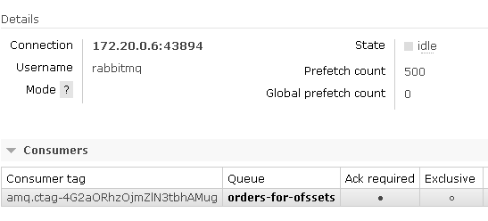
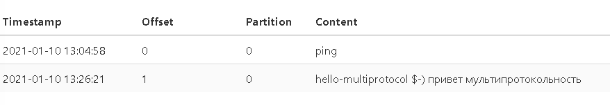
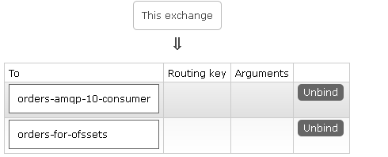

# Гибридный подход к интеграции

> специально для статьи на habr.com

Суть

* много разных приложений
* много разных протоколов

В чем польза

* инфраструктурщики обеспечивают максимальное количество протоколов "как сервис"
* кодеры выбирают протокол под задачу - как на стороне приемника, так и на стороне получателя
* трансформация между протоколами задача разработчика интеграционного контура (принято считать что это Синьор Джавист ;-) хотя трансформатор можно напилить на NodeJS, C#, Python, OneScript, 1C - разницы никакой)

так сказать на пути "к шине интеграции"

## Попробовать

* прочитать статью на Хабре
* убедится что установлен **Docker Engine**
* выполнить:

```
git clone https://github.com/aliczin/hybrid-eventing
cd hybrid-eventing
git submodule update --init --recursive
echo "Собираем синхронизатор AMQP2Kafka"
-1-build-connect-jar.bat
echo "Собираем образ AMQP2Kafka"
docker-compose -f dockers/infra.yml build
echo "Запускаем инфраструктуру"
docker-compose up -d -f dockers/infra.yml
echo "Запускаем приложения"
docker-compose up -f dockers/applications.yml
```

переходим по адресам

* http://localhost:15672/#/queues/%2F/orders-for-ofssets - там живет реплика очереди для Kafka



* http://localhost:8080/ui/clusters/local/topics/orders-from-amqp/messages - там живет топик Кафка - уже со смещениями



* http://localhost:15672/#/exchanges/%2F/orders-send - а тут живет топология RMQ




смотрим логи, смотрим исходники, радуемся, думаем - оцениваем

> А вы в курсе что теперь под Windows можно использовать `Home` редакцию для экспериментов с Docker https://docs.docker.com/docker-for-windows/install-windows-home/ 

Обсудить можно:

* в комментариях На Хабре - https://habr.com/ru/post/536680/
* в дискуссиях на Github - https://github.com/aliczin/howto-be-digital/discussions/20 
* в канале Телеграм в посте с которого данная работа начиналась - https://t.me/ineedlustin/265  

[](https://creativecommons.org/licenses/by/4.0/) [](https://creativecommons.org/licenses/by/4.0/)
