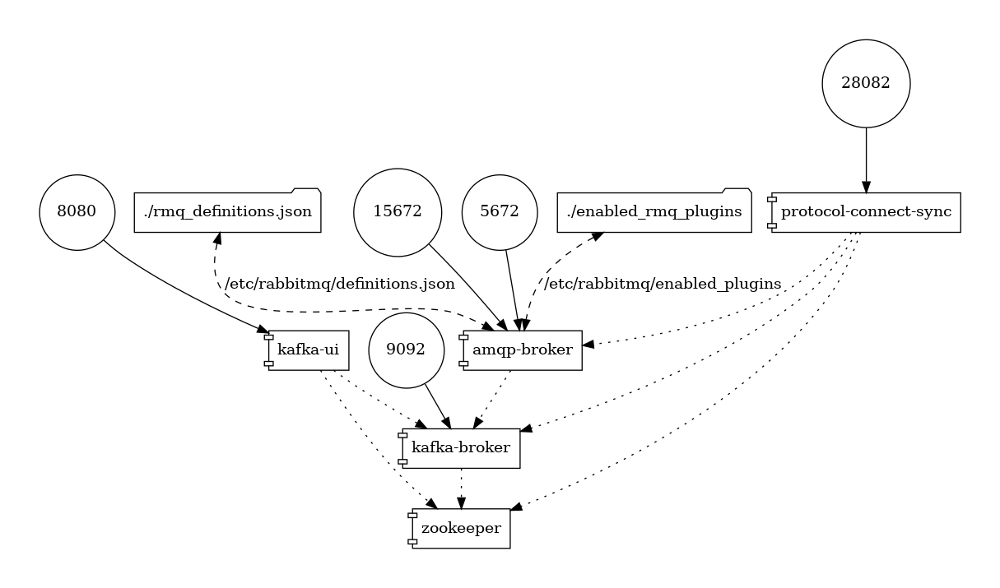
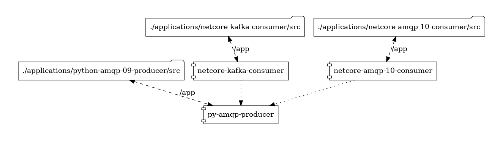
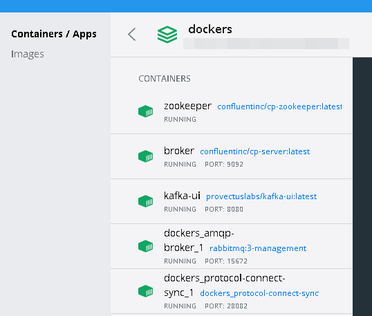
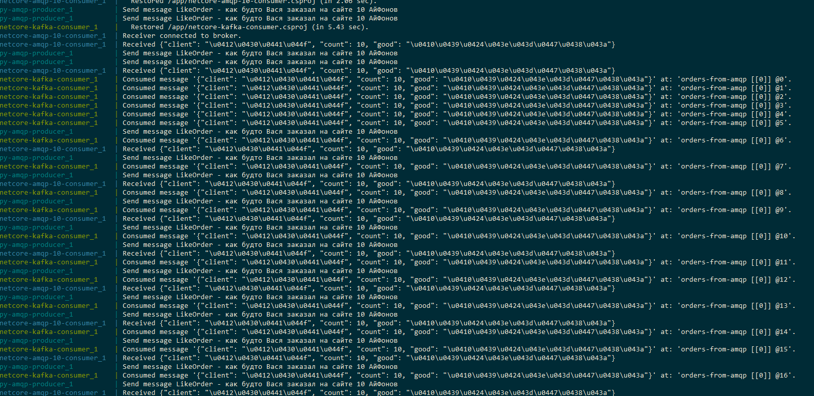
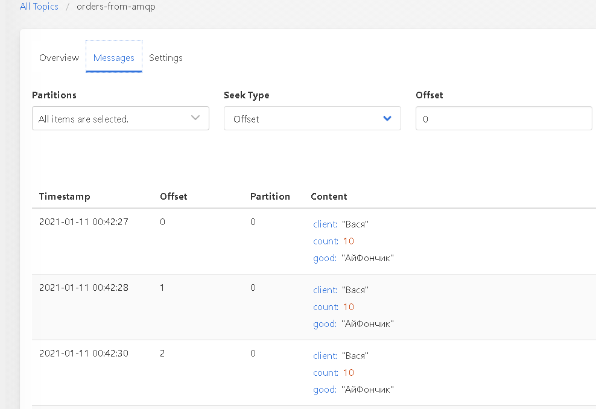
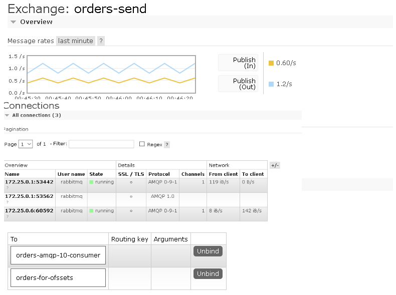
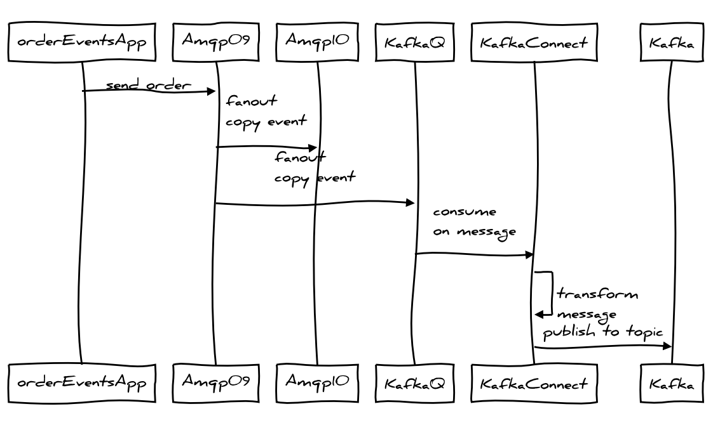
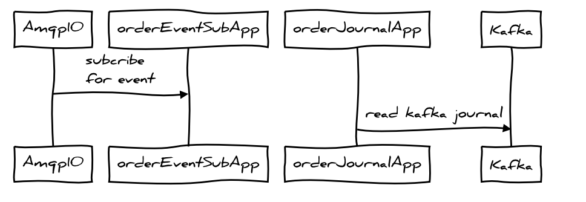

  
  
#  Гибриды побеждают или холивары дорого
  
  
Мотивом для написания данной статьи послужил тот факт, что на habr.com участилось появление материалов маркетингового характера про Apache Kafka. А также тот факт, что из статей складывается впечатление что пишут их немного далекие от реального использования люди. Почему-то в большинстве своем статьи обязательно содержат сравнение Apache Kafka с RabbitMQ, причем не в пользу последнего. Что самое интересное - читая подобные статьи управленцы без технического бэкграунда начинают тратить деньги на внутренние исследования, чтобы ведущие разработчики и технические директора выбрали одно из решений. Так как я очень жадный/домовитый, а также так как, я сторонник тезиса "В споре НЕ рождается истина" предлагаю вам ознакомится с другим подходом - почти без сравнения разных брокеров.
  
- [Гибриды побеждают или холивары дорого](#гибриды-побеждают-или-холивары-дорого )
  - [Без сравнения никуда](#без-сравнения-никуда )
  - [Сократ не говорил, что в споре рождается истина](#сократ-не-говорил-что-в-споре-рождается-истина )
  - [Поставил и забыл - уже не работает](#поставил-и-забыл-уже-не-работает )
  - [Чтобы вы смогли проэкспериментировать сами](#чтобы-вы-смогли-проэкспериментировать-сами )
  - [Докер контура для экспериментов](#докер-контура-для-экспериментов )
    - [Развертываем RabbitMQ и Kafka](#развертываем-rabbitmq-и-kafka )
    - [Запускаем наши приложения](#запускаем-наши-приложения )
      - [А где же Java ?](#а-где-же-java )
  - [Итоговая схема](#итоговая-схема )
  - [Ключевые посылы](#ключевые-посылы )
  - [Примечание для понимающих](#примечание-для-понимающих )
    - [Финальное примечение для любителей писать ТЗ по ГОСТу](#финальное-примечение-для-любителей-писать-тз-по-госту )
  
##  Без сравнения никуда
  
  
Вообще, по правильному, я должен был сделать статью в формате `Kafka+RabbitMQ+Nats+ActiveMQ+Mosquito+etc`, но мне кажется, что для Вас дорогие читатели это будет перебор, хотя обычно в моих архитектурных решениях присутствуют все вышеуказанные сервисы (и не только). И это я еще не рассказываю про AzureServiceBus/AmazonServiceBus - которые также участвуют в "гибридах" при крупных программах проектов. Поэтому пока остановимся на связке Kafka+RabbitMQ и далее вы поймете почему: по аналогии можно подключить любой сервис с его протоколом. Потому что:
  
> сравнивая Apache Kafka и RabbitMQ вы сравниваете 2 (два) бренда, а точнее 2 компании - Confluent и vmWare, и немножко Apache Software Foundation (но это не компания)
  
то есть формально при сравнении мы должны сравнивать бизнес-модели компаний которые являются основными драйверами развития наших сегодняшних подоопытных. Так как Хабр все таки не портал экономических исследований, поэтому мы для начала должны вспомнить не бренды, а те описания которые стоят за этими брендами (то как сами себя называют наши сегодняшние участники).
  
* **RabbitMQ** - мультипротокольный и расширяемый брокер сообщений
* **Apache Kafka** - платформа для распределенной потоковой передачи событий
* **Confluent Platform** - платформа потоковой передачи событий с возможностью создания высокопроизводительных конвейеров обработки данных для целей аналитики и интеграции в бизнес-сценариях
  
Я не зря третьим пунктом выделяю наработки компании Confluent - те кто собирается использовать Apache Kafka в продуктиве должны хотя бы видеть какую функциональность дополнительно добавляет Confluent к Apache Kafka. А это `SchemeRegistry`, `RestProxy`, `kSQL` и еще несколько интересных штук, о одной из которых мы поговорим ниже, она называется `Kafka-Connect`.
  
Но вернемся к сравнению - внимательный читатель видит, что RabbitMQ сам себя называет брокером сообщений выделяя свою главную фишку "мультипротокольность", а товарищи из экосистемы Kafka почему-то называют себя аж платформой (завышенное самомнение оно такое).
  
Итак - чтобы было совсем понятно, куда я веду.
  
* ключевая особенность RabbitMQ - **мультипротокольность** и расширяемость. (основной язык якобы Erlang)
* ключевая особенность экосистемы Kafka - **потоковая передача с обработкой** (основной язык якобы Scala/Java)
  
Отсюда и возникают минусы каждого из решений
  
* для RabbitMQ мы не сможем построить нормального решения для потоковой обработки. Точнее сможем, но **НЕ штатно**.
* а для Kafka мы не сможем сделать мультипротокольность, точнее сможем но **НЕ штатно**.
  
##  Сократ не говорил, что в споре рождается истина
  
  
Еще одна новость: действительно если почитать источник, то Сократ вообще-то в итоге пришел к тому, что нужно обеспечить диалог, а если по научному - то истина рождается в `научном споре`, который формально представляет собой процесс `публикация со ссылкой на источники` -> `а затем научная критика опонентов` -> `истина`
  
А значит перейдем к ссылкам - для начала их будет три. Когда 14 лет назад я совместно с коллегами начинал использовать брокеры сообщений в качестве основы для построения своих интеграционных решений, мы сразу обратили внимание, что фактически с точки зрения "клиента" (конечного приложения), под разные задачи подходят разные протоколы интеграции.
  
* ODBC
* AMQP
* MSMQ
* XMPP
* IP over Avian Carriers
  
так как тогда наша задача была интегрировать всякое (python, C#, java) и 1С - был придуман проект `One-S-Connectors` (https://code.google.com/archive/p/one-c-connectors/source/default/source). Сейчас он имеет сугубо академический интерес (так как в 1С мире моя персона достаточно известна и на Хабре много 1С специалистов из сообщества "воинствующих 1С-ников" - эта ссылка специально для них). 
Однако уже тогда (в 2006 году) стало понятно, что по большому счету конечному разработчику придется менять/выбирать протокол под бизнес-задачу. А инфраструктурщикам придется обеспечить максимально широкий спектр интеграционных протоколов. От ODBC до Kafka/NATs/ModBus.
  
Но вернемся к дню сегодняшнему - когда я начал использовать в проектах уровня ГИС (госсударственные информационные системы) различные транспорта данных `внезапно выяснилось`, что универсальные адаптеры - это не только концепт воинствующих 1С-ников, но и соседей. Поэтому многие идеи при внедрении черпались из еще двух интересных проектов
  
* библиотека Kombu (для Python) - https://docs.celeryproject.org/projects/kombu/en/stable/introduction.html#transport-comparison
* комплект CAP для .NetCore - https://github.com/dotnetcore/CAP
  
> маленькое примечание для менеджеров про Kombu - как то так получилось, что имплементация протокола Apache Kafka до сих пор открыта https://github.com/celery/kombu/issues/301 и почему-то перешла в разряд "Дайте денег", поэтому для Python проектов приходится использовать дополнительно https://github.com/confluentinc/confluent-kafka-python
  
Когда вы дочитаете до этого момента - предполагаю, что вы зададите вопрос про остальные языки: Java, GoLang, RUST, etc. Но во первых я не зря выше указал что по серьезному в наш обсуждаемый сегодня гибрид нужно добавить историю про NATs и ActiveMQ и внезапно JMS, а во вторых мы переходим к еще трем полезным ссылкам
  
* https://github.com/rabbitmq/rabbitmq-server/tree/master/deps/
* https://docs.confluent.io/current/connect/kafka-connect-rabbitmq/index.html 
* https://github.com/84codes/kafka-connect-rabbitmq/blob/master/docker-compose.yml 
  
Прокоментируем их ? Дело в том, что как бы вы не хотели, а для полноценного использования "в длинную" - вам придется подписаться на историю релизов как сервера RabbitMQ и самое главное на те самые **расширения** (лежат в каталоге `/deps`) которые постоянно добавляются в ядро RabbitMQ, так и на портал компании Confluent где она публикует приложения полезные для конечного бизнеса использующего Apache Kafka в продуктиве.
  
> подход к расширяемости за счет активируемых расширений также используется в экосистеме PostgreSQL - тот который `CREATE EXTENSION hypopg`, так что подход реализованный компанией Pivotal/vmWare далеко не новый в нашем чудесном мире архитектуры программного обеспечения
  
Дополнительно - на чудесном рынке облачных услуг в формате "Серьезная штука как сервис" есть еще один игрок - это компания `84Codes` https://github.com/84codes. Когда в рамках проектов внедрения нет нормальных инженеров по инфраструктуре - именно **84Codes** спасает пилотные проекты, потому как у них можно легко арендовать бесплатные/сильнодешевые контура CloudAMQP и CloudKarafka.
  
Я как бы обещал, что не буду ничего говорить про деньги, однако придется отразить 2 ключевых момента:
  
* компания vmWare зарабатывает известно на чем, поэтому RabbitMQ ей развивается как часть своей платформы - то есть они инвестируют в открытый проект не особо занимаясь его монетизацией. Возврат их инвестиций происходит в других местах, ну и также за счет контрибьторов на GitHub.
* а вот компания Confuent собирается монетизировать свою платформу через Enterprise лицензию в которую включает те самые коннекторы `Enterprise-Kafka-Connect`, а также GUI для управления платформой.
  
Когда-то давно существовал https://github.com/jcustenborder/kafka-connect-rabbitmq, примечателен тот факт что товарищ Джереми его скрыл, оставив только свои наработки для Java разработчиков в виде Maven Archetype https://github.com/jcustenborder/kafka-connect-archtype - еще раз обращаю Ваше внимание, что компания Confluent будет и дальше пытаться монетизировать свою деятельность, так что переводить всю интеграцию только на Kafka я бы на вашем месте поостерегся.
  
Поэтому когда вам **`топят за Kafka`** учитывайте, что вы либо изучаете Java, либо платите за Enterprise лицензию. А когда вам **`топят за RabbitMQ`** учитывайте, что либо вы изучаете системное администрирование (Erlang накладывает особенности системного администрирования), либо покупаете сервис у провайдеров типа `84Codes`. Кодить на Erlang никогда не придется - там это не нужно, если только вы не контрибьюторы OpenStack.
  
##  Поставил и забыл - уже не работает
  
  
Приближаемся к дальнейшему пониманию. Данный раздел уже будет полезен инфраструктурщикам, хотя и разработчикам важно знать, что в эпоху когда семимильными шагами развивается имплементация ITILv4, для того чтобы перейти от текста и евангелизма к реальности нам придется понять 3 тезиса
  
* использование только одного протокола интеграции приводит к появлению **ProtocolLock** и как следствие к **VendorLock** - я же не зря выше написал, что за каждым открытым продуктом, стоит какой-то ключевой комплект вендоров.
* в мире ИТ больше нет серьезных продуктов, которые бы представляли собой монолитную службу - все приложения давно стали **композитными**.
* все нормальные вендоры сокращают свои релизные циклы по ключевым продуктам - нормальной практикой стало выпускать редакции **`раз в 3 месяца`** - `TDD, BDD, CICD, ScallableAgile и DevOps (DocOps, DevSecOps)` - эти инженерные практики и методики управления не просто так развиваются. Всем очень хочется сокращать себестоимость и **TimeToMarket**.
  
Абзац выше важен, как финальный аккорд, прежде чем мы перейдем к *Docker-Compose*. А именно к нему я вел - чтобы и разработчики и инфраструктурщики понимали что такое **гибридная инфраструктура в режиме мультипротокольности (с)** - нужно сделать так, чтобы каждый мог проэкспериментировать с предлагаемым контуром. Как я уже указал выше - первично подобное применительно к Kafka+RabbitMQ было подсмотрено именно у коллег из `84Codes` (хорошие ребята - всем советую https://www.84codes.com/).
  
##  Чтобы вы смогли проэкспериментировать сами
  
  
Итак подходим к примерам, так как обоснования и вводных уже хватит. Предположим вы уже поняли, что вам также нужна мультипротокольность, однако мы же помним, что все рекламные материалы про Apache Kafka нам рассказывают что это единственное решение с реализацией `exactly-ones` доставки сообщений от отправителя получателю. Собственно на самом деле - нам и нужен гибрид, чтобы сделать из связки `ТочкаОбмена->Очередь` журнал Kafka (это тот который `Topic`) - чтобы возникла сущность под называнием `Offsets` у нашей очереди событий.
  
Предлагаю попробовать. Концепт для проверки Вашими руками будет состоять из:
  
* Zookeper
* KafkaBroker
* RabbitMQ
* KafkaConnect
  
и трех приложений приложений
  
* отправитель на Python по протоколу AMQP 0.9
* получатель на С# по протоколу AMQP 1.0
* получатель на C# по протоколу Kafka
  
> Еще интересное замечание: когда вы смотрите на всякие обучающие курсы по Apache Kafka - авторы "хитрецы" за 72 тысячи рублёв старательно пишут примеры на Java, это они делают скорее всего для того, чтобы скрыть от вас особенности использования **librdkafka** - C++ библиотеки на основе которой сделаны многие не-джава адаптеры. Я же наоборот предлагаю вам начинать исследование интеграции с Kafka именно с неё, чтобы четко оценивать риски "куда вы ввязываетесь"
  
ну и самое главное и тяжелое: 
  
контур содержит открытый форк старого `RabbitMQ-Kafka-Sinc-Connector` - того самого который товарищи из Confluent в своё время скрыли с Github.
  
##  Докер контура для экспериментов
  
  
Для показательного эксперимента мы сделаем 2 композитных приложения - инфраструктурное-трансформационное и непосредственно бизнес-приложения. 
  
###  Развертываем RabbitMQ и Kafka
  
  
контур инфраструктуры который нам понадобится - запускается достаточно просто
  
```sh
docker-compose -f dockers/infra.yml up -d
```  
  
Если вам интересно что же там внутри, нашего композитного приложения, то в конце статьи дается ссылка на полный комплект исходников, наиболее интересен в нем **Kafka-UI** и непосредственно **RabbitMQ-Sinc**, все остальное обычно и штатно для всех известных примеров по Kafka или RabbitMQ
  
```yml
    image: provectuslabs/kafka-ui:latest
    ports:
      - 8080:8080
    depends_on:
      - kafka-broker
      - zookeeper
    environment:
      KAFKA_CLUSTERS_0_NAME: local
      KAFKA_CLUSTERS_0_BOOTSTRAPSERVERS: broker:29092
      KAFKA_CLUSTERS_0_ZOOKEEPER: zookeeper:2181
      KAFKA_CLUSTERS_0_JMXPORT: 9101
  
```  
  
Но самое главное кроется в репозитории Java
  
```xml
    <parent>
        <groupId>com.github.jcustenborder.kafka.connect</groupId>
        <artifactId>kafka-connect-parent</artifactId>
        <version>1.0.0</version>
    </parent>
```  
  
Если подробно изучить **pom.xml** - то выяснится, что существует заглавный проект для всех конекторов к Кафка https://github.com/jcustenborder/kafka-connect-parent, в котором используется Java-Kafka-Adapter
  
И непосредственно синхронизацией c RMQ занимается штатный Java клиент - https://www.rabbitmq.com/java-client.html 
  
```xml
            <groupId>com.rabbitmq</groupId>
            <artifactId>amqp-client</artifactId>
            <version>${rabbitmq.version}</version>
```  
  
Таким образом - по правильному, чтобы получились повторить тот же эксперимент что и у меня, необходимо выполнить:
  
* собрать из исходников java синхронизатор - `-1-build-connect-jar.bat`
* собрать контейнер с синхрозатором - `00-build-connect-image.sh`
  
и уже потом запустить полный инфраструктурный контур
  
* стартуем полный инфраструктурный контур - `01-start-infra.sh`
  
> обратите внимание - так как Docker использует разное поведение при работе с PWD для Windows и Linux - приходится делать дубликаты скриптов. В остальных случаях - под обоими операционными системами используется интерпретатор sh
  
В итоге вы получите следующий комплект сервисов
  

  
Назначение портов:
  
* **9092** - будет использоваться для Kafka протокола
* **8080** - используется для отображения красивой картинки состояния Apache Kafka UI
* **5672** - будет использоваться для протокола AMQP 0.9 и он же будет работать и как AMQP 1.0
* **15672** - используется для красивой картинки управления RabbitMQ
* **28082** - отладочный порт для управления через `curl` трансформатором протоколов
  
В этот момент нужно остановится и прокомментировать особенность развертывания RabbitMQ в Docker:
  
* хорошей практикой явлется версионирование включенных плагинов расширений - `enabled-rmq-plugins`
  
```   
[
    rabbitmq_management, 
    rabbitmq_amqp1_0, 
    rabbitmq_mqtt, 
    rabbitmq_federation, 
    rabbitmq_federation_management,
    rabbitmq_shovel,
    rabbitmq_shovel_management,
    rabbitmq_prometheus
].
```  
  
* а также в крупных проектах когда нужно передать разработчику преднастроеннух топологию точек обмена и очредей, можно и нужно добавлять это в виде конфигурационного файла - `rmq_definitions.json`
  
```json
     "bindings":[
        {
           "source":"orders-send",
           "vhost":"/",
           "destination":"orders-amqp-10-consumer",
           "destination_type":"queue",
           "routing_key":"",
           "arguments":{
  
```  
  
###  Запускаем наши приложения
  
  
Остается только запустить наши приложения эмулирующие подключения
  
```sh
docker-compose -f dockers/infra.yml restart protocol-connect-sync
  
docker-compose -f applications.yml build
docker-compose -f applications.yml up
```  
  
Топология наших тестовых приложений достаточно простая
  

  
Исходный код также максимально упрощён:
  
* отправляется как-будто бы заказ `Васи` с периодичностью в 2 секунды
  
```py
        producer = conn.Producer(serializer='json')
        producer.publish({'client': 'Вася', 'count': 10, 'good': 'АйФончик'},
                      exchange=order_exchange,
                      declare=[kafka_queue, amqp10_queue])
        time.sleep(2)
```  
  
``` line_begin=2 line_end=5  
RUN python -m pip install \
    kombu \
    librabbitmq
```  
  
причем используется для этого максимально производительная библиотека на Си для AMQP 0.9 - librabbitmq наследуется именно от неё https://github.com/alanxz/rabbitmq-c 
  
* создан подписчик который уже по протоколу AMQP 1.0 - смотрит в свою очередь и получает события, соответственно очередь очищащется и больше мы заказов Васи не получим. В этом потоке нам это и не нужно.
  
```cs
            Attach recvAttach = new Attach()
            {
                Source = new Source()
                {
                    Address = "orders-amqp-10-consumer",
                    Durable = 1,
                },
```  
  
```cs
  
            ReceiverLink receiver = 
                new ReceiverLink(session,"netcore_amqp_10_consumer", recvAttach, null);
  
            Console.WriteLine("Receiver connected to broker.");
  
            while (true) {
                Message message = receiver.Receive();
                if (message == null)
                {
                    Console.WriteLine("Client exiting.");
                    break;
                }
                Console.WriteLine("Received " 
                  + System.Text.Encoding.UTF8.GetString((byte[])message.Body)
```  
  
Причем в качестве драйвера выбран
  
```csproj
  <ItemGroup>
    <PackageReference Include="AMQPNetLite.Core" Version="2.4.1" />
  </ItemGroup>
  
```  
  
именно его https://github.com/Azure/amqpnetlite Microsoft использует для маркетинга своей реализации сервисной шины. Сообственно именно AMQP 1.0 как протокол они и рекламируют https://docs.microsoft.com/ru-ru/azure/service-bus-messaging/service-bus-amqp-overview
  
Ну и финально
  
* создан подписчик по протоколу Kafka - который при каждом старте перечитывает с нуля журнал отправленных заказов Васи. Тот самый Exactly-One.
  
```cs
                AutoOffsetReset = AutoOffsetReset.Earliest
```  
  
```cs
                c.Subscribe("orders-from-amqp");
```  
  
```cs
                    while (true)
                    {
                        try
                        {
                            var cr = c.Consume(cts.Token);
```  
  
Выглядит наш контур в итоге следующим образом:
  
* 5 инфраструктурных контейнера
  

  
* 3 контейнера с приложениями
  

  
* готовый журнал транзакций заказов который можно посмотреть через Kafka-Ui
  

  
* и готовый контур связей для RabbitMQ
  

  
####  А где же Java ?
  
  
Не волнуйтесь - при таком гибридном подходе, без неё никуда, для того чтобы всё вышеуказанное заработало пришлось сделать форк и актуализировать версии Kafka-Connect-Base
  
```   
[submodule "dockers/rabbitmq-kafka-sink"]
	path = dockers/rabbitmq-kafka-sink
	url = https://github.com/aliczin/kafka-connect-rabbitmq
  
```  
  
Но самое интересное не это, самое интересное что в этом самом Kafka-Connect нет по сути никакой магии - только код трансформации.
  
По сути нам предлагают:
  
* создать наследника абстрактной задачи Источника
  
```java
public class RabbitMQSourceTask extends SourceTask {
```  
  
* выполнить подписку на очередь сообщений
  
```java
        this.channel.basicConsume(queue, this.consumer);
        log.info("Setting channel.basicQos({}, {});", this.config.prefetchCount, this.config.prefetchGlobal);
        this.channel.basicQos(this.config.prefetchCount, this.config.prefetchGlobal);
```  
  
* трасформировать полученные сообщения в абстрактные записи причем с буфером.
  
```java
  @Override
  public List<SourceRecord> poll() throws InterruptedException {
    List<SourceRecord> batch = new ArrayList<>(4096);
  
    while (!this.records.drain(batch)) {
```  
  
Отдельно можно выделить чудесный трансформатор сообщений из AMQP 0.9 в Кафка. У несведующего в Java глаз может задергаться. У автора чувствуется многолетный опыт работы в J2EE.
  
```java
  private static final Logger log = LoggerFactory.getLogger(MessageConverter.class);
  static final String FIELD_ENVELOPE_DELIVERYTAG = "deliveryTag";
  static final String FIELD_ENVELOPE_ISREDELIVER = "isRedeliver";
  static final String FIELD_ENVELOPE_EXCHANGE = "exchange";
  static final String FIELD_ENVELOPE_ROUTINGKEY = "routingKey";
  
  static final Schema SCHEMA_ENVELOPE = SchemaBuilder.struct()
      .name("com.github.jcustenborder.kafka.connect.rabbitmq.Envelope")
      .doc("Encapsulates a group of parameters used for AMQP's Basic methods. See " +
          "`Envelope <https://www.rabbitmq.com/releases/rabbitmq-java-client/current-javadoc/com/rabbitmq/client/Envelope.html>`_")
      .field(FIELD_ENVELOPE_DELIVERYTAG, SchemaBuilder.int64().doc("The delivery tag included in this parameter envelope. See `Envelope.getDeliveryTag() <https://www.rabbitmq.com/releases/rabbitmq-java-client/current-javadoc/com/rabbitmq/client/Envelope.html#getDeliveryTag-->`_").build())
      .field(FIELD_ENVELOPE_ISREDELIVER, SchemaBuilder.bool().doc("The redelivery flag included in this parameter envelope. See `Envelope.isRedeliver() <https://www.rabbitmq.com/releases/rabbitmq-java-client/current-javadoc/com/rabbitmq/client/Envelope.html#isRedeliver-->`_").build())
      .field(FIELD_ENVELOPE_EXCHANGE, SchemaBuilder.string().optional().doc("The name of the exchange included in this parameter envelope. See `Envelope.getExchange() <https://www.rabbitmq.com/releases/rabbitmq-java-client/current-javadoc/com/rabbitmq/client/Envelope.html#getExchange-->`_"))
      .field(FIELD_ENVELOPE_ROUTINGKEY, SchemaBuilder.string().optional().doc("The routing key included in this parameter envelope. See `Envelope.getRoutingKey() <https://www.rabbitmq.com/releases/rabbitmq-java-client/current-javadoc/com/rabbitmq/client/Envelope.html#getRoutingKey-->`_").build())
      .build();
```  
  
Но... Не будем критиковать, мы же в самом начале договорились - что наза главная задача добиться конечного результата удобным на сегодня способом. А итоги у нас получаются следующие.
  
##  Итоговая схема
  
  
Все что здесь продемонстрировано естественно лежит на Github. 
В репозитории - https://github.com/aliczin/hybrid-eventing. Лицензия выставленна простая до невозможности **Creative Commons Attribution 4.0 International**.
  
Полезно использовать в обучающих целях для команд разработки и инфраструктуры - и поиграться с DevOps и поиграться с мультипротокольными приложениями. Ничего особо экстравагантного в данном концепте конечно нет, ключевое тут я как я написал в самом начале - мы делаем избыточное количество интеграционных протоколов, добавляя транформаторов между потоками интеграции.
  
Схема коммуникации в итоге для "разработчика интеграционных потоков" (с) выглядит следующим образом - для источника и брокеров
  
```sequence
orderEventsApp->Amqp09: send order
Amqp09->Amqp10: fanout\n copy event
Amqp09->KafkaQ: fanout\n copy event
KafkaQ->KafkaConnect: consume\n on message
KafkaConnect->KafkaConnect: transform\n message
KafkaConnect->Kafka: publish to topic
```
  

  
а для приемников - все упрощается
  
```sequence
Amqp10->orderEventSubApp: subcribe\n for event
orderJournalApp->Kafka: read kafka journal
```
  

  
##  Ключевые посылы
  
  
Ключевые моменты которые я хотел расскрыть данной статьей
  
* стройте эксперименты и продуктивы с Apache Kafka не со штатным Java клиентом, а librdkafka и базирующихся на ней адаптерах - это позволит вам отладить сценарии разных версий протоколов `KafkaAPI`. Java вам пригодится в другом месте.
  
* не ввязывайтесь с священные войны, что лучше RabbitMQ/Kafka/Nats/ActiveMQ - просто развертывайте сервисы и публикуйте протоколы и пробуйте свои бизнес-сценарии.
  
* начните уже внедрять продуктивный Docker, или хотя бы пилотные и разработческие контура.
  
* реальный ИТ ландшафт почти всегда будет мультипротокольным 
  
##  Примечание для понимающих
  
  
чтобы гибриды развивались дальше:
  
* **Mosquito** - очень удобен как встраиваемый брокер на уровне контролера SCADA для преобразования из ModBus/OPC-UA. Хотя как вы уже поняли из статьи - интересны реализации "мостов из протокола в протокол" - пример https://github.com/mainflux/mainflux 
* **ActiveMQ** - удобен для Java разработчиков, потому что у них есть боязнь Erlang, но как мы выше уже сказали - мост `RabbitMQ AMQP 1.0 -> ActiveMQ` легко организуется средствами RabbitMQ.
* **NATs** - интересен как часть `OpenFaaS` платформы, при внедрении "своего маленького" `Amazon Lambda` с преферансом. И опять же подход будет всё тот же - мосты с трансформацией: https://github.com/nats-io/nats-kafka
  
Надеюсь мой архитектурный подход Вам придется по душе и вы перестанете тратить деньги заказчика (инвестора/свои - если вы стартапщик: Маша это замечание специально для тебя) на бессмысленные обсуждения что же выбрать в качестве брокера/платформы, и начнете наконец-то делать функциональность, которая будет использовать тот протокол, который удобен прямо сейчас. С возможностью переключения в случае **"если чё"** 
  
```Gherkin
Функциональность: Мультипротокольный адаптер
    Как разработчик я хочу иметь абстракцию Produser/Consumer
    С возможность изменения протокола интеграции
    Чтобы под каждую задачу выбирать разные протоколы 
    и единый интерфейс вызова для обеспечения независимости от вендора предоставляющего транспорт
  
Сценарий: vmWare реализует протокол Stream средствами RabbitMQ 
    Когда vmWare закончит свой плагин для потоков
    Тогда я активирую новый протокол 
    И быстро воткну его в приложение
    И так как у меня есть продуктивный кластер RabbitMQ
    И мне нужно будет просто поменять канал для отдельных бизнес сценариев
  
Сценарий: Завтра придут 1С-ники со своим ActiveMQ из Шины для 1С
    Когда мне нужно быстро включить очереди 1С в общий контур
    И чтобы на Питоне использовать старые наработки с Kafka API
    Тогда я добавляю трансформацию ActivemeMQ2Kafka
    и живу по старому а события ходят уже и из 1С
  
etc
```
  
А чтобы вы не думали, что данный подход - это нечто уникальное - вот Вам еще интересная ссылка: https://github.com/fclairamb/ftpserver/pull/34 - это когда нужен FTP сервер, а хочется S3.
  
Ну и в качестве финального момента - обратите внимание: есть и риски данного подхода: но они я думаю Вам и так понятны. 
  
* Придется оркестрировать такой комплект сервисов и вручную это почти невозможно. Придется использовать DevOps штуки типа k8s, OpenShift, etc - но если вы уже решились на интеграцию в режимах слабой связаности приложений в режиме онлайн, у вас что-то на эту тему уже скорее всего есть.
* Трансформаторы между протоколами на данный момент приходится дорабатывать - ничего готового открытого PRODUCTION-READY на данный момент найти почти невозможно.
  
###  Финальное примечение для любителей писать ТЗ по ГОСТу
  
  
так как Хабр читают любители цифровой трансформации (чтобы кто не понимал под этим словом) советую в техническое задание добавлять не упоминание конкретных реализации серверов, а что-то примерно следующее:
  
> комплект программ для интеграции должен реализовывать коммуникацию конечных приложений по открытым протоколам HTTP, AMQP 0.9, AMQP 1.0, Apache Kafka не ниже версии 23, MQTT, WebSockets, <ЛюбойДругойХотьSOAPХотяЭтоЖуть> с возможность преобразования между протоколами дополнительными средствами администрирования
  
Надеюсь моя публикация после долгого перерыва Вам будет полезна в ваших интеграционных проектах. Предполагаю что будет вопрос про 1С - и тут у меня совет только один. Используйте Google по ключевым словам `1С+RabbitMQ или 1С+Kafka или 1С+OpenFaas` - и RabbitMQ и Kafka "в 1С" давно и непринужденно используются. Потому что 1С - это не только язык, но и несколько сообществ где уже давно сделаны все возможные адаптеры и платные и бесплатные. Собственно как и в C#/Python/C++/Rust/etc.
  
Данная статья написана с применением расширения https://shd101wyy.github.io/markdown-preview-enhanced для Visual Studio Code - за что автору летят дополнительные лучи добра.
  
Ну и в качестве финального момента хотел бы заметить, что выбор `Cunfluent Inc` в качестве платформы разработки `Kafka-Connect` - экосистемы JDK выглядит все таки странно. Не удивлюсь если их конкуренты сделают такое же, но на GoLang, NodeJS (что-нибудь типа `Kafka-Beats-Hub`)
  

  
Красивые картинки в формате GraphViz я делаю при помощи хитрого проекта Docker2GraphViz - помогает поддерживать актуальный контур и техническую документацию в формате Markdown
```bat
  
set CURPATH=%~dp0
set DOCKER_DIR=%CURPATH%\dockers
  
docker run --rm -it --name dcv -v %DOCKER_DIR%\:/input pmsipilot/docker-compose-viz render -m image --force --output-file=infra-topology.png infra.yml
docker run --rm -it --name dcv -v %CURPATH%\:/input pmsipilot/docker-compose-viz render -m image --force --output-file=apps-topology.png applications.yml
  
copy /b/v/y dockers\infra-topology.png content\assets\infra-topology.png
copy /b/v/y apps-topology.png content\assets\apps-topology.png
```  
  